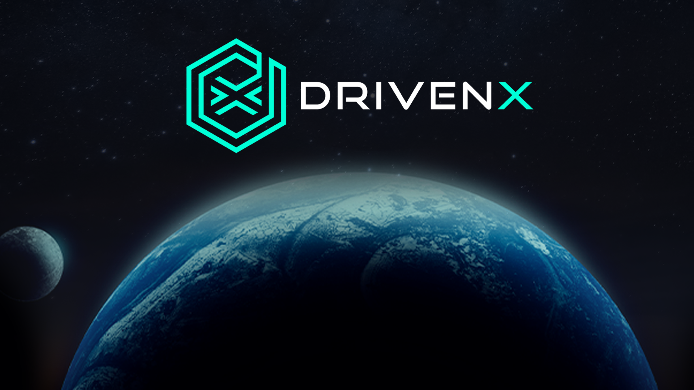

# DRIVENx

## Background

Blockchain networks enable the quick, secure, transfer, and production of digital products, as well as the storage and execution of tamper-proof programs capable of managing digital assets. Once deployed on-chain, these programs cannot be modified and are open to everyone with access to the chain. They execute depending on the defined parameters and interactions \(transactions\) and are verified by the blockchain's consensus process. These features enable anonymous parties to enter into legally enforceable digital contracts known as smart contracts.

The Binance Smart Chain \(BSC\) powers DRIVENx smart contract, which is a rich and expanding digital asset ecosystem driven by Binance DEX, the leading decentralized exchange.

Contain low transaction costs as low as one cent and high performance, with a network capable of creating a block every three seconds.

* Binance ecosystem that finances and bootstraps numerous DeFi projects
* A growing ecosystem of millions of users across Binance.com and Binance DEX
* BSC already collaborates with a network of important crypto projects.
* Contain low transaction costs as low as one cent
* High performance with a network that can generate a block every 3 seconds.

## What is DRIVENx?

DRIVENx \(DVX\) is a BEP20 token released on the Binance Smart Chain Network in June of 2021. Our focus is on bridging the gaps between cryptocurrency and standard FIAT-based business as usual.

DRIVENx is not just merely a token with utility, we are a movement! We are a community, a community of contributors and collaborators, a community that expects more from the crypto space!

DRIVEN’s primary goal is to bridge the needs of everyday businesses from your barber to your baker to your candlestick maker with the crypto ecosystem that enables them to use cryptocurrency for goods and services in a simple and intuitive manner, removing complexity from the current cumbersome process.

## What is the mission of the DRIVENx?

We are creating a platform in which businesses can carry out all of their existing transactions with respect to their customer's supply chain, via cryptocurrency.

The platform will enable a business to directly pay or receive funds for goods and/or services without having to convert their cryptocurrency to fiat currency, in turn avoiding costly foreign exchange fees and the associated price fluctuations. They can pay or receive the cryptocurrency of their choosing and transact in a peer-to-peer manner using our service as the intermediary broker for the transactions.

