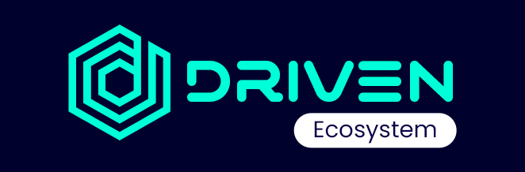

# DRIVENecosystem

## Background

Blockchain networks enable the quick, secure, transfer, and production of digital products, as well as the storage and execution of tamper-proof programs capable of managing digital assets. Once deployed on-chain, these programs cannot be modified and are open to everyone with access to the chain. They execute depending on the defined parameters and interactions \(transactions\) and are verified by the blockchain's consensus process. These features enable anonymous parties to enter into legally enforceable digital contracts known as smart contracts.

The Binance Smart Chain \(BSC\) powers DRIVENx smart contract, which is a rich and expanding digital asset ecosystem driven by Binance DEX, the leading decentralized exchange.

Contain low transaction costs as low as one cent and high performance, with a network capable of creating a block every three seconds.

* Binance ecosystem that finances and bootstraps numerous DeFi projects
* A growing ecosystem of millions of users across Binance.com and Binance DEX
* BSC already collaborates with a network of important crypto projects.
* Low transaction costs as low as one cent
* High performance with a network that can generate a block every 3 seconds.

## Mission

DRIVENecosystem \(or just DRIVEN\) is a small start-up that aims to integrate cryptocurrencies into everyday life through the use of smart applications. Our primary goal is to make cryptocurrency as simple to use as FIAT.

## Philosophy and vision

Our team is guided by core principles such as honesty, integrity, respect, ambition, and fun. By doing so, we build a strong community with the same values as us through time and with a lot of effort - a community that makes us proud, trusts us, and knows us for who we are.

Our goal is to build a strong DeFi ecosystem where individuals can use cryptocurrency to buy or trade goods and services.

## Goals

Our short-term goal is to raise awareness/exposure for the DRIVENecosystem projects: DRIVENx \(DVX\), MELONx \($MLNX\), and DRIVENsecurity \(Fundamental and technical analysis for DeFi projects\); and to execute on our promises every day in order to earn greater trust and authenticity.

Our long-term goal is to be a group of legal businesses with headquarters in the United States, Croatia, and Romania that transform the way people use cryptocurrency \(not just for profit\).

## Legal structure

DRIVENecosystem is not yet a legitimate business model. We intend to form an LLC before the end of the current calendar year \(2021\).

