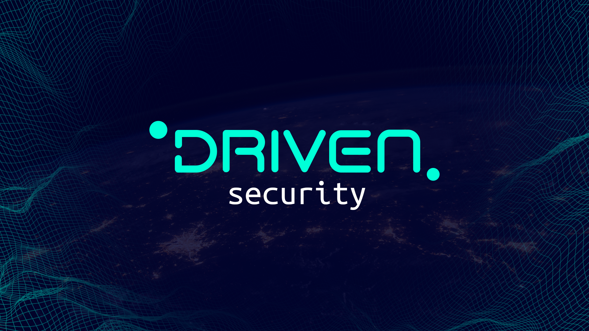

# DRIVENsecurity

## What is DRIVENsecurity?

Cryptocurrency is currently in a gold rush stage, with many new individuals entering the market, and whenever new people enter a market or space, there will always be others looking to take advantage of those new entrants. This is an undesirable occurrence in crypto space, but the reality is that it is quite simple due to the decentralized nature of cryptocurrency, people can steal your money in some instances, therefore we're here to help prevent that as much as we can using **DRIVENsecurity.**

DRIVENsecurity is a service that delivers fundamental and technical analysis for DeFi projects as part of the DRIVENEcosystem.

## Disclaimer

Accepting a project audit can be viewed as a sign of confidence and is typically the first indicator of trust for a project, but it does not guarantee that a team will not remove all liquidity, sell tokens, or engage in any other type of fraud. There is also no method to restrict private sale holders from selling their tokens. It is ultimately your obligation to read through all documentation, social media posts, and contract code for each particular project in order to draw your own conclusions and define your own risk tolerance.

DRIVENsecurity accepts no responsibility for any losses or speculative investments. This audit's material is given solely for informational reasons and should not be construed as investment advice.

## Fundamental Analysis

Fundamental Analysis is an overall project analysis with 10 separate aspects that will be evaluated before reaching a final decision. Every element will be rated with a number ranging from 1 to 5, and we will be able to obtain a total score for all aspects.

### List of Aspects

* Website Overview
* Basic Contract Audit
* Social Media Overview
* Team Overview
* Team Interview
* Token Distribution
* Top Token Holers \(Wallets\)
* Project Utility Overview
* Marketing Overview
* Whitepaper Overview

## Technical Analysis

We also deliver detailed smart contract audits that will be thoroughly examined and analyzed. This procedure is carried out to uncover mistakes, flaws, and security vulnerabilities in the code in order to recommend improvements and solutions. In general, smart contract audits are required because most contracts deal with financial assets.

