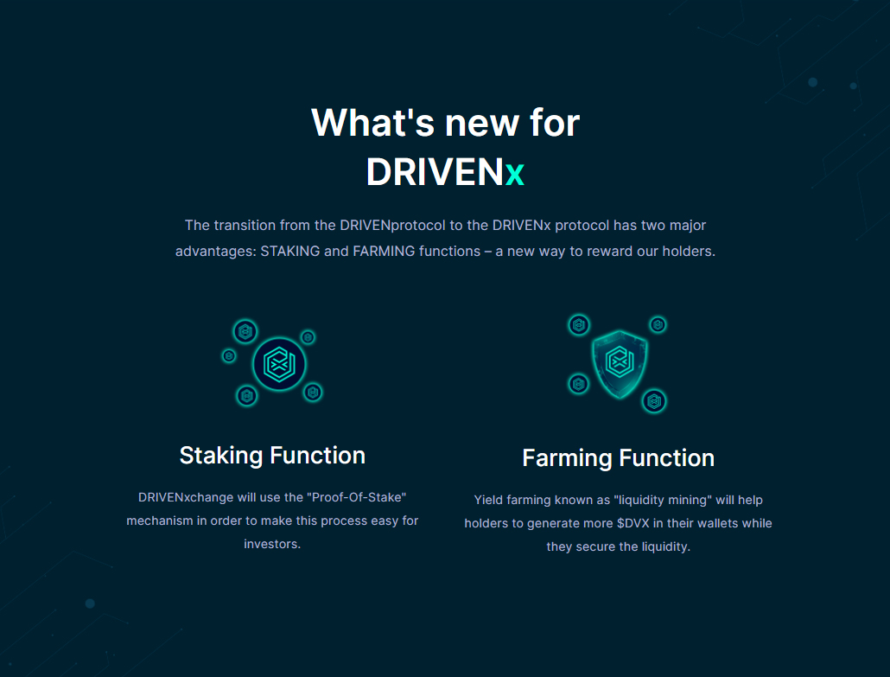

# DRIVENxchange

## What is DRIVENxchange?

DRIVENxchange is a DRIVEN-branded DEX designed specifically for tokens created by the DRIVENteam; the main token used on this exchange is DRIVENx.

DRIVENxchange, like PancakeSwap, has a slew of DeFi functions. DRIVENxhcange is an automated market maker \(AMM\) that allows users to trade cryptocurrency without the need for an order book. DRIVENxchange users may earn money via staking, contributing to liquidity pools, and yield farming.

## **First of all, what is yield farming?** 

Yield farming also referred to as liquidity mining, is a way to generate rewards with cryptocurrency holdings. It is simply a way for you to earn more by locking your cryptocurrency asset.

## What is staking?

Staking is the process of actively engaging in transaction validation on a proof-of-stake \(PoS\) blockchain \(similar to crypto mining\). Anyone with a minimum needed amount of a DRIVENx can validate transactions and receive Staking rewards on these blockchains.

