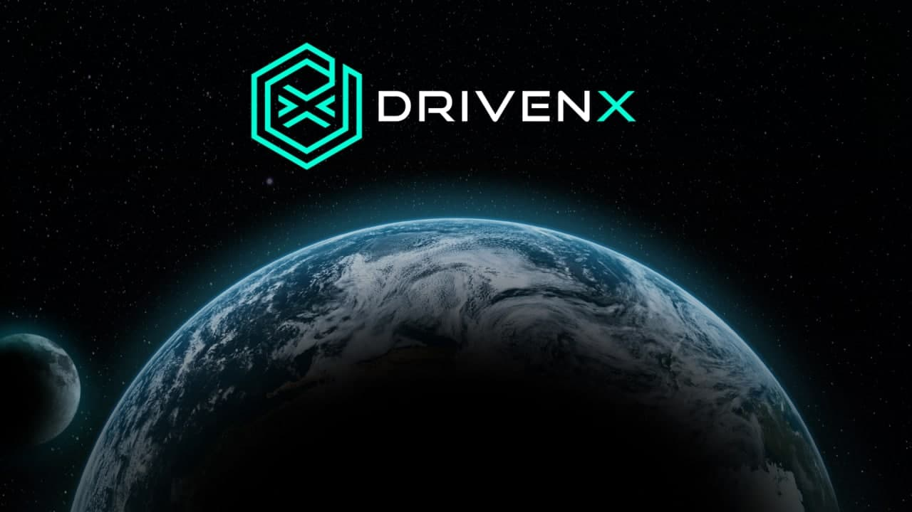

# DRIVENx

## What is DRIVENx?

DRIVENx \(DVX\) is a BEP20 token released on the Binance Smart Chain Network in June of 2021. Our focus is on bridging the gaps between cryptocurrency and standard FIAT-based business as usual.

DRIVENx is not just merely a token with utility, we are a movement! We are a community, a community of contributors and collaborators, a community that expects more from the crypto space!

DRIVEN’s primary goal is to bridge the needs of everyday businesses from your barber to your baker to your candlestick maker with the crypto ecosystem that enables them to use cryptocurrency for goods and services in a simple and intuitive manner, removing complexity from the current cumbersome process.

## What is the mission of the DRIVENx?

We are creating a platform in which businesses can carry out all of their existing transactions with respect to their customer's supply chain, via cryptocurrency. 

The platform will enable a business to directly pay or receive funds for goods and/or services without having to convert their cryptocurrency to fiat currency, in turn avoiding costly foreign exchange fees and the associated price fluctuations. They can pay or receive the cryptocurrency of their choosing and transact in a peer-to-peer manner using our service as the intermediary broker for the transactions. 

## Roadmap

### **0 - 5,000 holders**

✅ DRIVENx launch

✅ Begin the migration and upload the logo to TrustWallet

✅ DRIVENxchange launch

✅ Litepaper publication

⬜ First marketing push

⬜ TechRate smart contract audit

### 5,000 - 7,500 holders

⬜ Publication of the whitepaper

⬜ Apply for CoinGecko and CoinMarketCap

⬜ Introduce additional pairs for farming and staking on DRIVENxchange

⬜ The documentation phase for the B2B platform

### 7,500 - 20,000 holders

⬜ The documentation phase for the B2B platform

⬜ Form the DRIVENtrade core team

⬜ DRIVENtrade's user interface development

⬜ Launch a crowdsourcing campaign for DRIVENtrade

### Q1 2022

⬜ DRIVENtrade's technical whitepaper release

⬜ Launch DRIVENtrade

⬜ DRIVENtrade's user interface development

⬜ Begin DRIVENtrade's marketing campaigns

⬜ Implement the DRIVENtrade advertising function

⬜ Pitching investors

