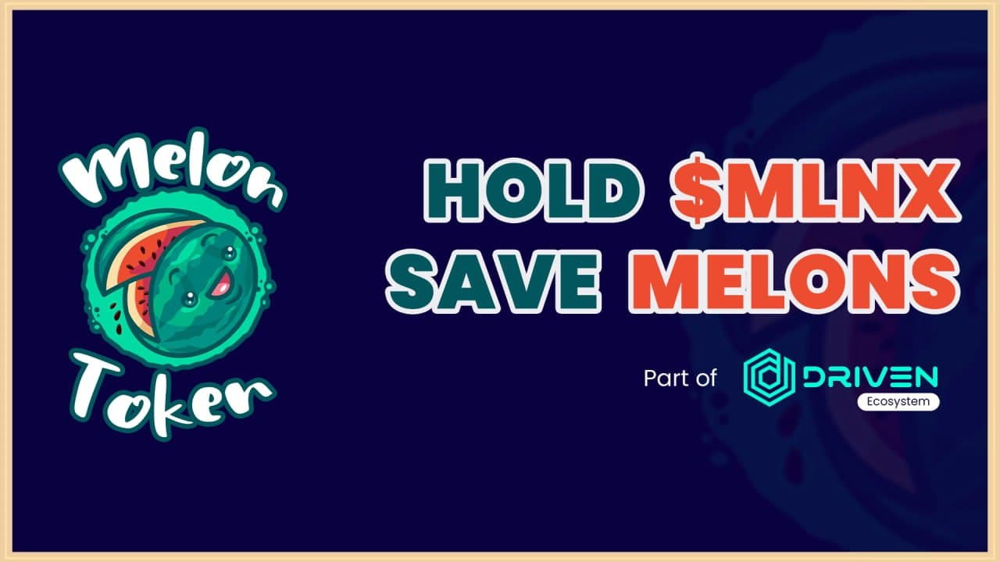

# MELONx

## What is MELONx?

MELONx is the second project of the DRIVENecosystem; it is a charity project that was created specifically to help women all over the world who are currently battling breast cancer. We sincerely hope they succeed. 

## What is the mission of the MELONx?

Our mission is to create a cryptocurrency donation platform to assist over 2,500 women in their fight against breast cancer. Development of this application has already begun, and expect to be done by the end of this year. 

The cryptocurrency donations platform will be our primary utility case. Because it is constructed on the blockchain, every transaction will be transparent, and people will be able to see that their money is going directly to the individual they want to help. Our primary mission is to assist over 2500 women in their fight against breast cancer.

We're also developing a lottery platform to have some fun with our community while simultaneously helping more ladies with breast cancer. People can put funds into the lottery pool, and one winner will be chosen every 24 hours to receive 80% of the total lottery prize-pool. The rest of the prize-poll \(included inside the lottery pool\) will be donated directly to a breast-cancer cause.

We have the ability to make a genuine difference for the larger good, rather than just for ourselves. We remind ourselves of our responsibility to make the world a better place for everyone by donating to those in need.

On each transaction, 10 percent of the built-in tokenomics is transferred into a charity wallet, from which we donate to women with breast cancer. So far, we have made six donations to people, which you can find on our [website](https://melontokenbsc.com/).

## Competitive Advantage

To avoid selling $MLNX to make donations, we will build a crypto donations platform where users can donate in BTC, BNB, ETH, and BEP20 tokens. A tiny portion of each transaction will be utilized to purchase $MLNX back.

## Roadmap

### **0 - 1,000 holders**

✅ Melon launch

✅ First donation to women with breast cancer

✅ Website creation

✅ Start of donations platform development

⬜ Whitepaper launch

### 1,000 - 5,000 holders

⬜ First marketing push

⬜ Additional donations for people with breast cancer

⬜ Influencer marketing

⬜ TechRate smart contract audit

⬜ Lottery system launch

⬜ Implementation of Melon logo in TrustWallet

⬜ Merch store launch

⬜ Apply for CoinGecko and CoinMarketCap listings

### 5,000 - 10,000 holders

⬜ Donations platform beta testing phase

⬜ Apply for additional exchange listings

⬜ Host charity events

⬜ Documentation phase for the crypto donations platform

### **Final purpose \(25,000+ holders\)**

⬜ Complete the development of our crypto donation platform in order to aid over 2,500 women in their battle against breast cancer. 

