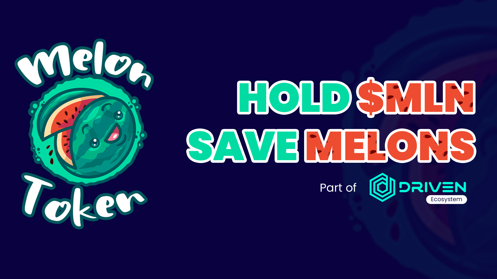

# Melon

## What is Melon?

Melon is the second project of the DRIVENecosystem; it is a charity initiative that was created specifically to help women all over the world who are currently battling breast cancer. We sincerely hope they succeed. 

## What is the mission of the Melon?

Our mission is to create a cryptocurrency donation platform to assist over 2,500 women in their fight against breast cancer. Development of this application has already begun, and expect to be done by the end of this year. 

We have the ability to make a genuine difference for the larger good, rather than just for ourselves. We remind ourselves of our responsibility to make the world a better place for everyone by donating to those in need.

On each transaction, 1.5 percent of the built-in tokenomics is transferred into a charity wallet, from which we donate to women with breast cancer. So far, we have made six donations to people, which you can find  on our [website](https://melontokenbsc.com/).

## Roadmap

### **0 - 1,000 holders**

✅ Melon launch

✅ First donation to women with breast cancer

✅ Website creation

✅ Start of donations platform development

⬜ Whitepaper launch

### 1,000 - 5,000 holders

⬜ First marketing push

⬜ Additional donations for people with breast cancer

⬜ Influencer marketing

⬜ TechRate smart contract audit

⬜ Lottery system launch

⬜ Implementation of Melon logo in TrustWallet

⬜ Merch store launch

⬜ Apply for CoinGecko and CoinMarketCap listings

### 5,000 - 10,000 holders

⬜ Donations platform beta testing phase

⬜ Apply for additional exchange listings

⬜ Host charity events

⬜ Documentation phase for the crypto donations platform

### **Final purpose \(25,000+ holders\)**

⬜ Complete the development of our crypto donation platform in order to aid over 2,500 women in their battle against breast cancer. 

