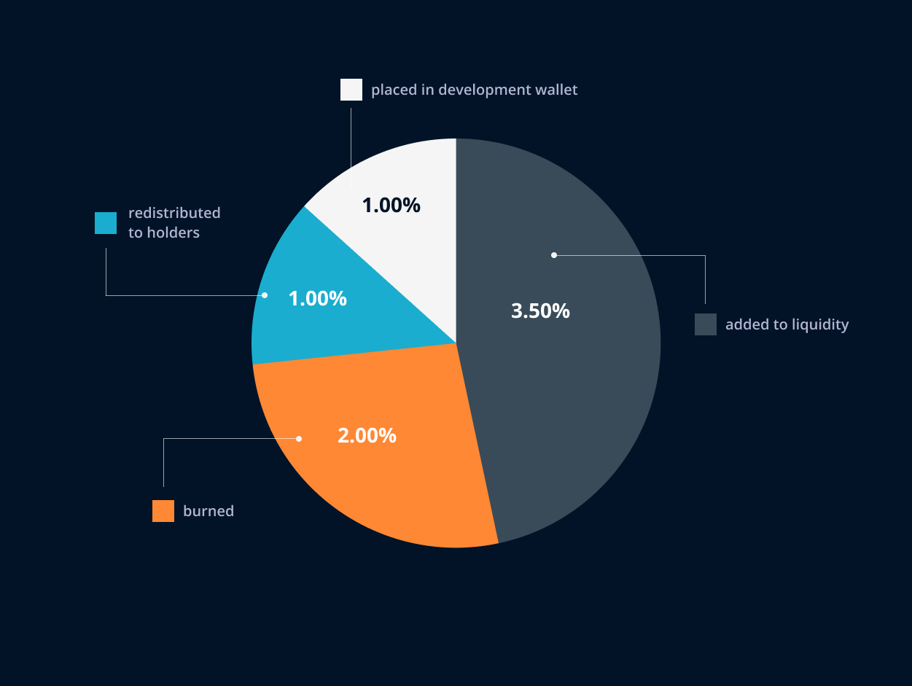

# DRIVENx Token

## What is DRIVENx Token?

**DRIVENx \(DVX\)** token is an updated deflationary version of the DRIVENprotocol token. It is an entirely new smart contract. It is the DRIVENecosystem's primary token. On our DRIVEN branded exchange, DRIVENx grants access to yield farming and staking. 

Token holders of the DRIVENprotocol had their tokens migrated in a 1:1 ratio \(only tokens they had before the 1st of June\)

DRIVENx was **launched on June 17th 2021**. A **fair-launch** for the community was our priority. Therefore, DRIVENx started with a market cap of only $100,000.

**DRIVENx – Starting Supply -** 100,000,000,000,000,000 ****

**DRIVENx –  Supply \(at this moment\) -** 87,000,000,000,000,000

## **DRIVENx Tokenomics**

DRIVENx is a **deflationary token**, which means that its total supply decreases with each token transaction. As with every transfer, a portion of the transferred amount is burned, added to liquidity, redistributed to holders, and placed in the development wallet.

* **3.5% added to liquidity**
* **2.0% burned**
* **1.0% redistributed to holders**
* **1.0% placed in development wallet**

## Supply

**100,000,000,000,000,000 - DRIVENx – Total Supply**

* 63,000,000,000,000,000 **– Migrated to DRIVENprotocol Holders \(63%\)**
* 19,000,000,000,000,000 **– Liquidity Mining and Staking Supply \(19%\)**
* 10,000,000,000,000,000 **– Burned Initially \(10%\)**
* 4,000,000,000,000,000 **– Development Wallet \(4.0%\)**

**Mining and staking supply address:** `0x98de08c254597963bc3e024fb477b72b48c5380c`

**Development wallet address:** `0xad5284df1ae5d8c860112e8e02e112a9caa7d66f`

**Marketing wallet address:** `0xc00f8776e5331f09f47c062f106c3c98c2a6c30d`

#### **Disclaimer** 

None of these wallets are locked, and we always notify our community in the Telegram group when we withdraw money from the marketing wallet, as well as where the funds will be invested.

\*\*\*\*

\*\*\*\*

\*\*\*\*

 ****

\*\*\*\*

