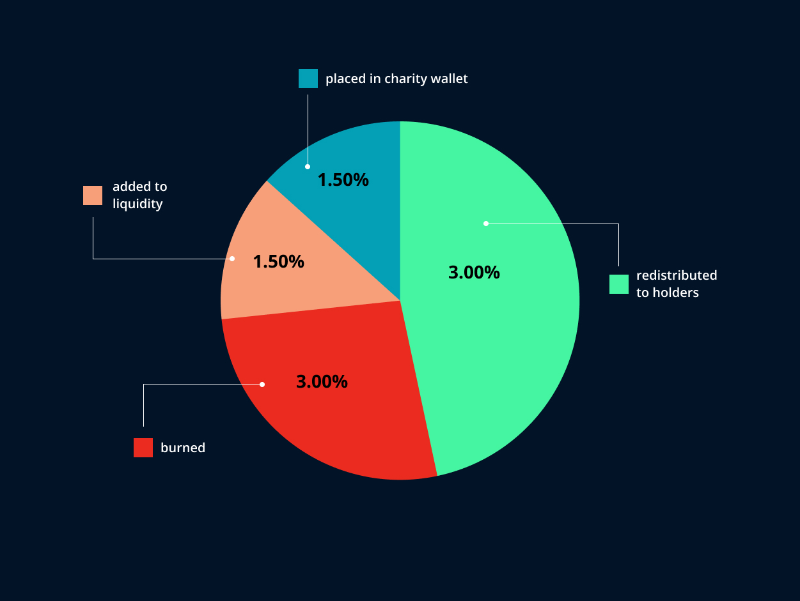

# Melon Token

**Melon \($MLN\)** is a deflationary and community-driven token that aids women all over the world in their fight against breast cancer. It is the DRIVENecosystem's charity token.

Melon was **launched on** **May 28th 2021.** A **fair-launch** for the community was our priority. Therefore, Melon started with a market cap of only $50,000.

**Melon – Starting Supply -** 100,000,000,000,000,000 ****

**Melon –  Supply \(at this moment\) -** 90,500,000,000,000,000

## **Melon Tokenomics**

**Melon** is a **deflationary token**, which means that its total supply decreases with each token transaction. As with every transfer, a portion of the transferred amount is burned, added to liquidity, redistributed to holders, and placed in the charity wallet.

* **3.0% burned**
* **3.0% redistributed to holders**
* **1.5% added to liquidity**
* **1.5% placed in charity wallet** 

  
****

\*\*\*\*

