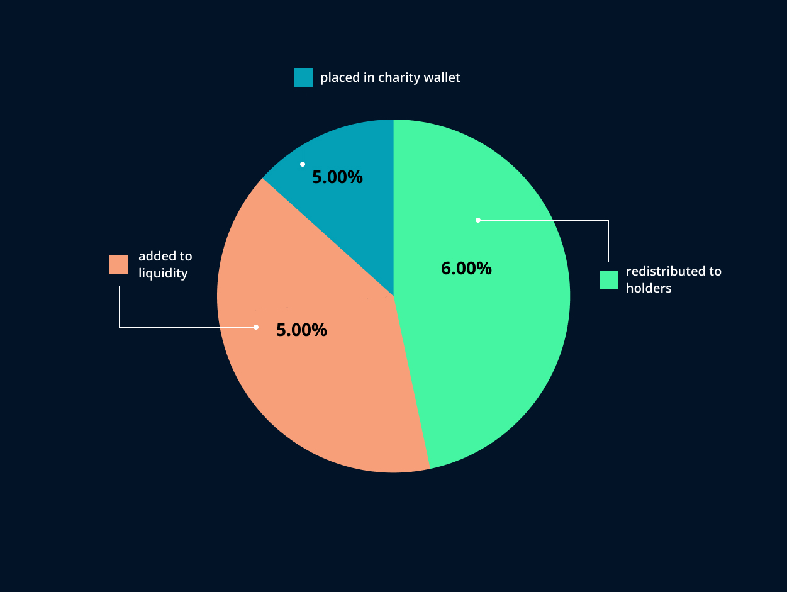

# MELONx Token

**MELONx \($MLNX\)** is a deflationary and community-driven token that aids women all over the world in their fight against breast cancer. It is the DRIVENecosystem's charity token.

Melon was **launched on** **May 28th 2021.** A **fair-launch** for the community was our priority. Therefore, Melon started with a market cap of only $50,000.

Together with our community we decided to migrate to better and improved contract for the Melon via the Telegram voting pool. On **August 13th we launched a V2 version of the Melon called MELONx**

## MELONx

New Melon contract was a significant improvement for Melon because the new contract allowed us to collect funds for marketing and donations in BUSD \(BEP20\), which means that we can make donations to women with breast cancer without crashing the price of the actual Melon, which was preventing us from making regular donations when the price was low. We will also be able to undertake frequent marketing promotions with the new contract. 

Our objective for the new MELONx contract was to make it more appealing to hold for the long term, therefore we decided to allocate a larger amount of tokenomics specifically for redistribution to holders, so Melon holders will receive token rewards for holding the Melon in BUSD \(BEP20\).

## **MELONx Tokenomics**

Melon ****is a **deflationary token**, which means that its total supply decreases with each token transaction. As with every transfer, a portion of the transferred amount is burned, added to liquidity pool, redistributed to holders, and placed in the charity/marketing wallet. 

On each transaction we charge 16% of taxes

* 5% added to liquidity pool
* 5% placed in marketing/charity wallet
* 6% redistributed to holders 

**MELONx – Starting Supply -** 100,000,000,000 ****

\*\*\*\*

  
****

\*\*\*\*

